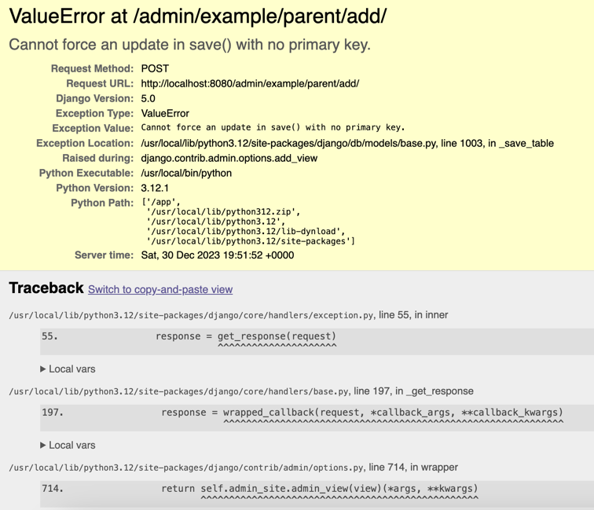

# BUG: Using Admin Inline and GeneratedField

To replicate:

1. On one terminal, run `DOCKER_BUILDKIT=1 docker compose up --build`
2. On a separate terminal, create a superuser: `docker-compose run --rm server bash -c "python manage.py createsuperuser"`
3. Login to admin and go to http://localhost:8080/admin/example/parent/add/
4. Populate the form and save
5. You should see the error similar to the screenshot
    
